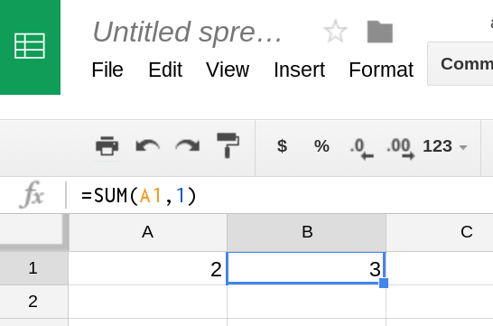

<div class="head">
   <div class="item"></div>
   <div class="item"><h1>TimeEngine</h1></div>
 </div>

[![NPM version][npm-image]][npm-url] [![Downloads][downloads-image]][npm-url][![Dependency status][david-dm-image]][david-dm-url][![Dev Dependency status][david-dm-dev-image]][david-dm-dev-url][]()

[npm-url]: https://npmjs.org/package/timeengine
[downloads-image]: http://img.shields.io/npm/dm/timeengine.svg
[npm-image]: http://img.shields.io/npm/v/timeengine.svg
[david-dm-url]:https://david-dm.org/kenokabe/timeengine
[david-dm-image]:https://david-dm.org/kenokabe/timeengine.svg
[david-dm-dev-url]:https://david-dm.org/kenokabe/timeengine#info=devDependencies
[david-dm-dev-image]:https://david-dm.org/kenokabe/timeengine/dev-status.svg

[david-dm-dev-image]:https://david-dm.org/kenokabe/timeengine/dev-status.svg

[https://www.npmjs.com/package/timeengine](https://www.npmjs.com/package/timeengine)

[https://github.com/TimeEngine/timeengine](https://github.com/TimeEngine/timeengine)

##### TimeEngine is a tiny, simple yet versatile library that provides first class reactive value 'over time' with smart dependency resolving capability in JavaScript. Built for a new programming paradigm: Dependency driven Functional Reactive Programming (DFRP).

### Install and Usage

- #### node

```bash
$ npm install timeengine
```

For Reat Programming, with [timeengine-react](https://www.npmjs.com/package/timeengine-react)

```bash
$ npm install timeengine-react
```

[immutable.js](https://www.npmjs.com/package/immutable) is required for `timeengine`.


```js
const __ = require('timeengine');
const Immutable = require('immutable');

// If with React Programming
const __Element = require("timeengine-react");
```

- #### Browser CDN

##### Download or use as a CDN

http://timeengine.github.io/cdn/timeengine.js

For Reat Prograamming, with [timeengine-react](https://www.npmjs.com/package/timeengine-react)

http://timeengine.github.io/cdn/timeengine-react.js


To use  [immutable.js](https://www.npmjs.com/package/immutable) from a browser, download [dist/immutable.min.js](https://github.com/facebook/immutable-js/blob/master/dist/immutable.min.js)
or use a CDN such as [CDNJS](https://cdnjs.com/libraries/immutable)
or [jsDelivr](http://www.jsdelivr.com/#!immutable.js).

Then, add it as a script tag to your page:


```
<script src="timeengine.js"></script>
<script src="timeengine-react.js"></script>
<script src="immutable.min.js"></script>
```

 ### TimeEngine is Tiny

Less than 200 lines of [the source-code](https://github.com/TimeEngine/timeengine/blob/master/timeengine.es).

 ### TimeEngine is Simple

Unlike other FRP libraries, TimeEngine has only a few APis.
Therefore, very easy to learn, hack, and debug.

 ### TimeEngine is yet Versatile

So, what is TimeEngine capable of?

For instance:

- Refactor a complicated stateful [React](https://facebook.github.io/react/) code to a Damn simple statelss
code.  `Demo #1`

- Replace other complicated FRP libraries to easy TimeEngine. `Demo #2`

- Write a clean Declarative code to animate physics equations with time-sequence. `Demo #3`

- Callback Alternative `Code #4`

- Asynchronous task control: alterative to  [async](https://github.com/caolan/async), [Promise](https://developer.mozilla.org/en-US/docs/Web/JavaScript/Reference/Global_Objects/Promise)  `Code #5`

-----

#### `Demo #1`

Timer

##### A Stateful Component (Sample Code from [the official React Site](https://facebook.github.io/react/))

```js
var Timer = React.createClass({
  getInitialState: function() {
    return {secondsElapsed: 0};
  },
  tick: function() {
    this.setState({secondsElapsed: this.state.secondsElapsed + 1});
  },
  componentDidMount: function() {
    this.interval = setInterval(this.tick, 1000);
  },
  componentWillUnmount: function() {
    clearInterval(this.interval);
  },
  render: function() {
    return (
      <div>Seconds Elapsed: {this.state.secondsElapsed}</div>
    );
  }
});
```

is refactored to   with `timeengine` + `timeengine-react`:

##### A Stateless functional Element (Single statement code!!)

```js
const TimerElement = __Element(__.intervalSeq(Immutable.Range(), 1000)
                      .__((count) => (<div>{"Timer : "}{count}</div>)));

const TopElement = (
<div>
   <p>{"HelloElement!!"}</p>
    {TimerElement}
</div>
);
```

 `.intervalSeq` is a special bridge API to map [Immutable-js](https://facebook.github.io/immutable-js/) infinite Sequence on TimeEngine infinite Sequence.

 In fact, you can create any time-sequences with rich API provided by [Immutable-js](https://facebook.github.io/immutable-js/) that is the only npm library TimeEngine depends on. With "Outsourcing" API, TimeEngine can stay simple, and programmers do not have to learn the library specific APIs from scratch, instead take advantage of accustomed, well-provided APIs by Immutable to obtain flexible power.

 In this code, [Natural number](https://en.wikipedia.org/wiki/Natural_number) is mapped with 1 second interval.

 <div id ="div0" class = "demo"/>

-----

#### `Demo #2`

Simple counter

##### [Bacon.js](https://baconjs.github.io/) + jQuery

```html
<h3> Simple counter </h3>
<div class="example">
  <div class="example-html">
    <p> <i> Behold!</i> It counts up and down as you click the buttons </p>
    <button id="up"> Up </button>
    <button id="down"> Down </button>
    <span id="counter"> 0 </span>
</div>
<button class="run">Reload</button>
```


```js
var up   = $('#up').asEventStream('click');
var down = $('#down').asEventStream('click');

var counter =
  // map up to 1, down to -1
  up.map(1).merge(down.map(-1))
  // accumulate sum
    .scan(0, function(x,y) { return x + y });

// assign observable value to jQuery property text
counter.assign($('#counter'), 'text');
// and some Reload implement Code
//..........................

```

#####  TimeEngine + React


 ```js
 const CounterElement = () => {
   const __updn = __();
   const __count = __([__updn])
     .__(([updn]) => ((updn === 0) ? (0) : (__count.t + updn)));
   const init = () => (__updn.t = 0); //initial value of count
   const __runNow = __
     .intervalSeq(Immutable.Seq.of(true), 0)
     .__(init);
   const __seqEl = __([__count])
     .__(([count]) => (<span>{count}</span>));
   return (<div>
            <button
     onClick={() => (__updn.t = 1)}>{"Up"}</button>
            <button
     onClick={() => (__updn.t = -1)}>{"Down"}</button>
            &nbsp;&nbsp;{__Element(__seqEl)}&nbsp;&nbsp;
            <button
     onClick={init}>{"Reset"}</button>
           </div>);
 };
 const mount1 = ReactDOM.render(<div>{CounterElement()}</div>, document.getElementById('div1'));
 ```

<div id ="div1" class = "demo"/>

-----

#### `Demo #3`

 Physics Equations


```js
  const PhysicsElement = () => {
    //MKS system of units
    const V0 = 90.0; // m/s
    const DEG = 45; //degree
    const THETA = DEG / 180 * Math.PI; //radian
    const G = 9.8; //gravity const
    //t seconds elapsed 10msec time resolution
    const t = __([__.intervalSeq(Immutable.Range(), 10)])
        .__(([count]) => (count * 10 / 1000));
    const x = __([t]).__(([t]) => V0 * Math.cos(THETA) * t);
    const y = __([t]).__(([t]) => V0 * Math.sin(THETA) * t - 1 / 2 * G * Math.pow(t, 2));
    //==================================
    const Drawscale = 1; //1 dot = 1 meter
    const __seqEl = __([x, y]) //atomic update
      .__(([x, y]) => (
      <div>
        <svg height = "250"  width = "100%">
            <circle r="2" fill="red"
        cx = {50 + x * Drawscale} cy = {250 - y * Drawscale}/>
        </svg>
      </div>));
    return __Element(__seqEl);
  };

  const WorldElement = () => {
    const __clicked = __();
    const onClick = () => {
      __clicked.t = true;
    };
    const __seqEl = __([__clicked])
      .__(() => (<div>{PhysicsElement()}</div>));

    return (<div>
      <div><button onClick={onClick}>{"Physics Start"}</button></div>
      {__Element(__seqEl)}
           </div>
      );
  };
   const mount2 = ReactDOM.render(<div>{WorldElement()}</div>, document.getElementById('div2'));
//..........................

```


<div id ="div2" class = "demo"/>

-----

#### `Code #4`

Callback Alternative

```js
const f = (__bcn) => {
  setTimeout(() => {
    __bcn.t = 'calling back!';
  }, 1000);
};

const __beacon = __();
const ts0 = __([__beacon])
  .__((beacon) => (__.log.t = beacon));

f(__beacon);
```
-----

#### `Code #5`

[Async.js parallel](https://github.com/caolan/async#parallel)

```js
const async = require("async");

async.parallel([
  function(callback) {
    setTimeout(function() {
      callback(null, 'one');
    }, 200);
  },
  function(callback) {
    setTimeout(function() {
      callback(null, 'two');
    }, 100);
  }
],
  // optional callback
  function(err, results) {
    // the results array will equal ['one','two'] even though
    // the second function had a shorter timeout.
    console.log(results);
  });

```

```
[ 'one', 'two' ]
```
TimeEngine code for parallel

```js
const __ = require("timeengine");
const Immutable = require("immutable");

const __data0 = __();
const __data1 = __();
const __data2 = __();

const __task1 = __data0
  .__((data0) => {
    setTimeout(function() {
      __data1.t = 'one';
    }, 200);
  });
const __task2 = __data0
  .__((data0) => {
    setTimeout(function() {
      __data2.t = 'two';
    }, 100);
  });

const __done = __([__data1, __data2])
  .__(([data1, data2]) => (__.log.t = [data1, data2]));

const __runNow = __
  .intervalSeq(Immutable.Seq.of(true), 0)
  .__(() => (__data0.t = "start"));
```

```
$ babel-node test99.es
>>>  [ 'one', 'two' ]
```

Notice the TimeEngine code is 100% declrarive, every line is
`const .....`.

------

[Async.js waterfall](https://github.com/caolan/async#waterfall)

```js
const async = require("async");

async.waterfall([
  async.apply(task1, 'zero'),
  task2,
  task3,
], function(err, result) {
  // result now equals 'done'
  if (err) {
    console.log(err);
  } else {
    console.log(result);
  }
});
function task1(arg1, callback) {
  // arg1 now equals 'zero'
  console.log(arg1);
  setTimeout(() => {
    const data = 'one';
    console.log(data);
    callback(null, data, 'two');
  }, 300);
}
function task2(arg1, arg2, callback) {
  // arg1 now equals 'one' and arg2 now equals 'two'
  setTimeout(() => {
    const data = 'two';
    console.log(data);
    callback(null, 'three');
  }, 100);
}
function task3(arg1, callback) {
  // arg1 now equals 'three'
  setTimeout(() => {
    const data = 'three';
    console.log(data);
    callback(null, 'done');
  }, 200);
}
```

```
zero
one
two
three
done
```

TimeEngine code for waterfall

```js
const __ = require("timeengine");
const Immutable = require("immutable");

const __data0 = __();
const __data1 = __();
const __data2 = __();
const __data3 = __();
const __err1 = __();
const __err2 = __();
const __err3 = __();

const __task1 = __data0
  .__((data0) => {
    __.log.t = data0;
    setTimeout(() => {
      const data = 'one';
      __data1.t = __.log.t = data;
    }, 300);
  });
const __task2 = __data1
  .__((data1) => {
    setTimeout(() => {
      const data = 'two';
      __data2.t = __.log.t = data;
    //  __err2.t = 'some error2';
    }, 100);
  });
const __task3 = __([__data1, __data2])
  .__(([data1, data2]) => { //can take multiple previous results
    setTimeout(() => {
      const data = 'three';
      __data3.t = __.log.t = data;
    }, 200);
  });
const __done = __data3
  .__((data3) => {
    __.log.t = 'done';
  });
const __errHandler1 = __err1
  .__((err1) => {
    __.log.t = err1;
  });
const __errHandler2 = __err2
  .__((err2) => {
    __.log.t = err2;
  });
const __errHandler3 = __err3
  .__((err3) => {
    __.log.t = err3;
  });
const __runNow = __
  .intervalSeq(Immutable.Seq.of(true), 0)
  .__(() => (__data0.t = "zero"));
```

```
$ babel-node test99.es
>>>  zero
>>>  one
>>>  two
>>>  three
>>>  done
```

if error occurs on task2

```
//  __data2.t = __.log.t = data;
__err2.t = 'some error2';
```


```
>>>  zero
>>>  one
>>>  some error2
```

Notice the TimeEngine code is 100% declrarive, every line is
`const .....`.

-----

 [Promise](https://developer.mozilla.org/en-US/docs/Web/JavaScript/Reference/Global_Objects/Promise)

`Promise.then`

#####  Promise.then

```js
      const p = new Promise((resolve, reject) => {
        setTimeout(() => {
          resolve(99);
        }, 0);
      });

      p
        .then((value) => {
          console.log(value); // 99
          return value + 1;
        })
        .then((value) => {
          console.log(value); // 100
        });
```

#####  TimeEngine code

```js
      const __p = __();
      const __p2 = __p
        .__((value) => {
          __.log.t = value; //99
          return value + 1;
        })
        .__((value) => {
          __.log.t = value; //100
          return value + 1;
        });

      const __log = __p2.log("__p2");
      __p.t = 99;
      __p.t = 999;
```


-----


`Promise.all`

#####  Promise.all

```js
      const PromiseCreateFunc = (value, time) => {
        const promise = new Promise((resolve, reject) => {
          setTimeout(() => {
            resolve(value);
          }, time);
        });
        return promise;
      };

      var promise0 = PromiseCreateFunc("aaaaa", 300);
      var promise1 = PromiseCreateFunc("bbbbb", 100);
      var promise2 = PromiseCreateFunc("ccccc", 200);
      var promiseAll = Promise.all([promise0, promise1, promise2]);

      promiseAll.then((value) => {
        console.log(value);
      });

```

#####  TimeEngine code

```js
      const __a = __
        .intervalSeq(Immutable
          .Seq.of("aaaaa"), 300);
      const __b = __
        .intervalSeq(Immutable
          .Seq.of("bbbbb"), 100);
      const __c = __
        .intervalSeq(Immutable
          .Seq.of("ccccc"), 200);

      const promiseAll = __([__a, __b, __c]);
      const __log1 = promiseAll.log();

```

-----

#### `Demo #9`

 Simple Draw


```js
const canvas = document.getElementById('canvas1');
const ctx = canvas.getContext('2d');
const __mouseDown = __();
const __drawFrom = __();
const __drawTo = __()
  .__(
    (val) => {
      ctx.beginPath();
      ctx.moveTo(__drawFrom.t.x, __drawFrom.t.y);
      ctx.lineTo(val.x, val.y);
      ctx.closePath();
      ctx.stroke();
      __drawFrom.t = val;
      return val;
    }
);
canvas.onmousedown = (e) => {
  __mouseDown.t = 1;
  __drawFrom.t = {
    x: e.clientX,
    y: e.clientY
  };
};
canvas.onmouseup = (e) => {
  __mouseDown.t = 0;
};
canvas.onmousemove = (e) => {
  if (__mouseDown.t === 1) {
    __drawTo.t = {
      x: e.clientX,
      y: e.clientY
    };
  }
};
```
## DRAW HERE ↓

<canvas id="canvas1" width="900" height="500"></canvas>

-----

<script src ="./jsx/draw.js"></script>

-----


-----

#### `Demo #10`

ToDo List (React & timeengine-react)


```js
(() => {
  'use strict';
  const TodoElement = () => {
    const ClockElement = __Element(__
      .intervalSeq(Immutable.Range(), 100)
      .__(() => (<div>{moment().format('MMMM Do YYYY, h:mm:ss a')}</div>)));
    const __items = __(true);
    const ListElement = __Element(__([__items])
      .__(() => ((__items).map((item) => (<li>{item}</li>)))));
    const InputElement = () => {
      const __value = __();
      const onChange = (e) => (__value.t = e.target.value);
      const onClick = () => (__.log.t = __items.t = __value.t);
      const __seqEl = __([__value])
        .__((value) => (<div>
        <input type="text" value={value} onChange={onChange}/>
        <button onClick = {onClick}>{'NewToDo#' + (__items.length + 1)}</button></div>));
      const dummy = __.log.__(() => (__value.t = ""));
      __.log.t = "started!";
      return __Element(__seqEl);
    };
    return (<div><h2>ToDo</h2>
      {ClockElement}<p/>
      {ListElement}
      {InputElement()}</div>);
  };
  const mount = ReactDOM.render(TodoElement(), document.getElementById('todo'));
})();
```

<div id ="todo" class = "demo"/>
<script src ="./jsx/todolist.js"></script>


#### `Demo #11`

ToDo Multiple List  (React & timeengine-react)


```js
const TodoElement = () => {
  const ClockElement = __Element(__.intervalSeq(Immutable.Range(), 100)
    .__(() => (<div>{moment().format('MMMM Do YYYY, h:mm:ss a')}</div>)));
  const __fdList = __().__((val) => (__.log.t = val));
  const __lists = __(true).__((__list) => (__fdList.t = __lists.length));
  const ListofListElement = __Element(__([__lists])
    .__(() => ((__lists).map((list, i) => (
      <button onClick = {() => (__.log.t = __fdList.t = i)}>{'List#' + (i + 1)}</button>)))));
  const InputElement = () => {
    const __value = __();
    const onChange = (e) => (__value.t = e.target.value);
    const onClick = () => (__.log.t = __lists[__fdList.t].t = __value.t);
    const onClickNL = () => (__.log.t = __lists.t = __(true));
    const __seqEl = __([__value]).__((value) => (<div>
          <h4>{'List#' + (__fdList.t + 1)}
          <button onClick = {onClickNL}>{'NewList'}</button></h4>
            {__lists[__fdList.t].map((item) => (<li>{item}</li>))}
            <input type="text" value={value} onChange={onChange}/>
            <button onClick = {onClick}>{'NewToDo#' + (__lists[__fdList.t].length + 1)}</button></div>));
    __.log.__(() => (__value.t = ""));
    return __Element(__seqEl);
  };
  __lists.t = __(true); //new items-list
  const __delay = __.intervalSeq(Immutable.Seq.of("started!"), 1000)
    .__(() => (__.log.t = "showInput"));
  return (<div><h2>ToDo</h2>{ClockElement}<p/>
      {ListofListElement}<p/>{InputElement()}</div>);
};
const mount = ReactDOM.render(TodoElement(), document.getElementById('todo'));
```


<div id ="todo2" class = "demo"/>
<script src ="./jsx/todolist2.js"></script>


<script src ="./jsx/div-react.js"></script>


---------

--------

### TimeEngine provides first class reactive components with smart dependency resolving capability in JavaScript.


## `b = a + 1`


### Dependency Structure

<div id="node1" class = cyte/>
<script>
(()=>{
				 cytoscape({
					container: document.getElementById('node1'),
          boxSelectionEnabled: false,
          autounselectify: true,

          userZoomingEnabled: false,
          userPanningEnabled: false,
					layout: {
						name: 'dagre'
					},
					style: [
						{
							selector: 'node',
							style: {
								'content': 'data(id)',
								'text-opacity': 0.5,
								'text-valign': 'center',
								'text-halign': 'right',
								'background-color': '#11479e'
							}
						},
						{
							selector: 'edge',
							style: {
								'width': 4,
								'target-arrow-shape': 'triangle',
								'line-color': '#9dbaea',
								'target-arrow-color': '#9dbaea'
							}
						}
					],
					elements: {
						nodes: [
							{ data: { id: 'a' } },
							{ data: { id: 'b' } },
						],
						edges: [
							{ data: { source: 'a', target: 'b' } },
						]
					},
				});
})()
</script>


`a`'s dependency is nothing.

`b`'s dependency is `a`.


```js
const __a = __();
const __b = __([__a]).__(([a]) => (a + 1));

a.t = 1;
```

#### output
```
__a: 1
__b: 2
```

## `c = a + b`


<div id="node2" class = cyte/>
<script>
(()=>{
				 cytoscape({
					container: document.getElementById('node2'),
          boxSelectionEnabled: false,
          autounselectify: true,

          userZoomingEnabled: false,
          userPanningEnabled: false,
					layout: {
						name: 'dagre'
					},
					style: [
						{
							selector: 'node',
							style: {
								'content': 'data(id)',
								'text-opacity': 0.5,
								'text-valign': 'center',
								'text-halign': 'right',
								'background-color': '#11479e'
							}
						},
						{
							selector: 'edge',
							style: {
								'width': 4,
								'target-arrow-shape': 'triangle',
								'line-color': '#9dbaea',
								'target-arrow-color': '#9dbaea'
							}
						}
					],
					elements: {
						nodes: [
							{ data: { id: 'a' } },
							{ data: { id: 'b' } },
              { data: { id: 'c' } },
						],
						edges: [
							{ data: { source: 'a', target: 'c' } },
            	{ data: { source: 'b', target: 'c' } },
						]
					},
				});
})()
</script>

`a`'s dependency is nothing.

`b`'s dependency is nothing.

`c`'s dependency is `a` and `b`.


```js
const __a = __();
const __b = __();
const __c = __([__a, __b]).__(([a, b]) => (a + b));

const __log1 = __a.log("__a");
const __log2 = __b.log("__b");
const __log3 = __c.log("__c");

__a.t = 2;
__b.t = 3;
```

#### output

```
__a: 2
__b: 3
__c: 5
```

##  Physics Equations


<div id="node3" class = cyte2/>
<script>
(()=>{
				 cytoscape({
					container: document.getElementById('node3'),
          boxSelectionEnabled: false,
          autounselectify: true,

          userZoomingEnabled: false,
          userPanningEnabled: false,
					layout: {
						name: 'dagre'
					},
					style: [
						{
							selector: 'node',
							style: {
								'content': 'data(id)',
								'text-opacity': 0.5,
								'text-valign': 'center',
								'text-halign': 'right',
								'background-color': '#11479e'
							}
						},
						{
							selector: 'edge',
							style: {
								'width': 4,
								'target-arrow-shape': 'triangle',
								'line-color': '#9dbaea',
								'target-arrow-color': '#9dbaea'
							}
						}
					],
					elements: {
						nodes: [
							{ data: { id: 't' } },
							{ data: { id: 'x' } },
              { data: { id: 'y' } },
              { data: { id: '[x, y]' } },
						],
						edges: [
							{ data: { source: 't', target: 'x' } },
            	{ data: { source: 't', target: 'y' } },
              { data: { source: 'x', target: '[x, y]' } },
            	{ data: { source: 'y', target: '[x, y]' } },
						]
					},
				});
})()
</script>

#### Define the "time-flow" as a sequence, as a reactive value

A time-sequence, `t` that has 10mil seconds interval = resolution of the time.

`t` depends on **time of our real world**.

```js
const t = __
      .intervalSeq(Immutable.Range(), 10)
      .__((count) => (count * 10 / 1000));
```

#### Equations for `x` and `y` depend on `t`

```js
const x = __([t]).__(([t]) => V0 * Math.cos(THETA) * t);
const y = __([t]).__(([t]) => V0 * Math.sin(THETA) * t - 1 / 2 * G * Math.pow(t, 2));
```

#### Cordinate `[x, y]` is to be updated synchronously (atomic update)

```js
 __([x, y]) //atomic update
```

The code:

```js
   const t = __
     .intervalSeq(Immutable.Range(), 10)
     .__((count) => (count * 10 / 1000));
   const x = __([t]).__(([t]) => V0 * Math.cos(THETA) * t);
   const y = __([t]).__(([t]) => V0 * Math.sin(THETA) * t - 1 / 2 * G * Math.pow(t, 2));
   //==================================
   const Drawscale = 1; //1 dot = 1 meter
   const __seqEl = __([x, y]) //atomic update
     .__(([x, y]) => (
     <div>
       <svg height = "250"  width = "100%">
           <circle r="2" fill="red"
       cx = {50 + x * Drawscale} cy = {250 - y * Drawscale}/>
       </svg>
     </div>));
```

### Sequence has update cycle

Dependencies are resolved on every `t` update cycle.

### Dependencies are updated in non-interference way


<div id="node4" class = cyte2/>
<script>
(()=>{
				 cytoscape({
					container: document.getElementById('node4'),
          boxSelectionEnabled: false,
          autounselectify: true,

          userZoomingEnabled: false,
          userPanningEnabled: false,
					layout: {
						name: 'dagre'
					},
					style: [
						{
							selector: 'node',
							style: {
								'content': 'data(id)',
								'text-opacity': 0.5,
								'text-valign': 'center',
								'text-halign': 'right',
								'background-color': '#11479e'
							}
						},
						{
							selector: 'edge',
							style: {
								'width': 4,
								'target-arrow-shape': 'triangle',
								'line-color': '#9dbaea',
								'target-arrow-color': '#9dbaea'
							}
						}
					],
					elements: {
						nodes: [
							{ data: { id: 'a' } },
							{ data: { id: 'b' } },
              { data: { id: 'c' } },
              { data: { id: 'ab' } },
              { data: { id: 'bc' } },
						],
						edges: [
							{ data: { source: 'a', target: 'ab' } },
            	{ data: { source: 'b', target: 'ab' } },
              { data: { source: 'b', target: 'bc' } },
            	{ data: { source: 'c', target: 'bc' } },
						]
					},
				});
})()
</script>

```js
const __a = __();
const __b = __();
const __c = __();

const __ab = __([__a, __b]).__(([a, b]) => (a * b));
const __bc = __([__b, __c]).__(([b, c]) => (b * c));

const __log1 = __a.log("__a");
const __log2 = __b.log("__b");
const __log3 = __c.log("__c");
const __log4 = __ab.log("__ab");
const __log5 = __bc.log("__bc");

__a.t = 2;
__b.t = 3; //__b update is managed in non-interference way
__c.t = 5;

```

#### output

```
__a: 2
__b: 3
__ab: 6
__c: 5
__bc: 15

```


### Complicated Dependencies resolution capability


<div id="node5" class = cyte3/>
<script>
(()=>{
				 cytoscape({
					container: document.getElementById('node5'),
          boxSelectionEnabled: false,
          autounselectify: true,

          userZoomingEnabled: false,
          userPanningEnabled: false,
					layout: {
						name: 'dagre'
					},
					style: [
						{
							selector: 'node',
							style: {
								'content': 'data(id)',
								'text-opacity': 0.5,
								'text-valign': 'center',
								'text-halign': 'right',
								'background-color': '#11479e'
							}
						},
						{
							selector: 'edge',
							style: {
								'width': 4,
								'target-arrow-shape': 'triangle',
								'line-color': '#9dbaea',
								'target-arrow-color': '#9dbaea'
							}
						}
					],
					elements: {
						nodes: [
							{ data: { id: 'a' } },
							{ data: { id: 'b' } },
              { data: { id: 'c' } },
              { data: { id: 'd' } },
              { data: { id: 'e' } },
              { data: { id: 'atomic' } },
						],
						edges: [
							{ data: { source: 'a', target: 'b' } },
            	{ data: { source: 'a', target: 'c' } },
              { data: { source: 'b', target: 'c' } },
            	{ data: { source: 'b', target: 'd' } },
              { data: { source: 'a', target: 'e' } },
              { data: { source: 'b', target: 'e' } },
              { data: { source: 'c', target: 'e' } },
              { data: { source: 'd', target: 'e' } },

              { data: { source: 'a', target: 'atomic' } },
              { data: { source: 'b', target: 'atomic' } },
              { data: { source: 'c', target: 'atomic' } },
              { data: { source: 'd', target: 'atomic' } },
              { data: { source: 'e', target: 'atomic' } },
						]
					},
				});
})()
</script>

```js
const __a = __();
const __b = __([__a]).__(([a]) => a * 2);
const __c = __([__a, __b]).__(([a, b]) => a + b * 3);
const __d = __([__b]).__(([b]) => b * 100);
const __e = __([__a, __b, __c, __d])
  .__(([a, b, c, d]) => a + b + c + d);
const __atomic = __([__a, __b, __c, __d, __e]);

const __log1 = __a.log('__a');
const __log2 = __b.log('__b'); // b.t = 1 * 2 = 2
const __log3 = __c.log('__c'); // c.t = 1 + 2 * 3 = 7
const __log4 = __d.log('__d'); // d.t = 2 * 100 = 200
const __log5 = __e.log('__e'); //210
const __log6 = __atomic.log('__atomic');

__a.t = 1; // the whole val will be updated
__a.t = 2;
```

#### output

```
__a: 1
__b: 2
__c: 7
__d: 200
__e: 210
__atomic: [ 1, 2, 7, 200, 210 ]
__a: 2
__b: 4
__c: 14
__d: 400
__e: 420
__atomic: [ 2, 4, 14, 400, 420 ]
```

### Sanity check to prevent to set a value on Sequence that depends on other sequences

```js
__b.t = 99;
```

#### output

```
ERROR! cannot set a value on sequence that depends on other sequences
```

-----

## API

TimeEngine has only a few api, so easy to learn.

### Top level API

#### `__([dependentSeqs][, store])`

Constructor of TimeEngine `Seq`

- `dependentSeqs` Array
- `store` Boolean

#### `__.intervalSeq(Immutable.Seq, interval)`

Constructor of TimeEngine `Seq` that depends on time of real world with an interval of `interval`.

- `Immutable.Seq` [Immutable Seq](https://facebook.github.io/immutable-js/docs/#/Seq)  
- `interval` Number

#### `__.log.t = val`

Show log `val`

- `val` Object


### Sequence level API

#### `Seq.__(function)`

Attach function that is evaluated when the sequence dependencies are fulfilled.

- `function` Function

seq.eqs = [f1, f2, f3];

seq.t => f1 => f2=> f3=> seq.valOnT


```
seq.evalEqs = (val) => {
      seq.eqs.map((eq) => (val = eq(val)));
      return val;
    };

seq.valOnT = seq.evalEqs(tval);
```

#### `Seq.log([val])`

Show log `val` and TimeEngine `Seq`.

- `val` Object


# Basic Study


## What is Functional Programming? or What makes Functional Programming possible?

In short, function is first class object.
function = value.


## Event-driven programming is Cool

We all know that. The goodness of event-driven programming is one of the few topics that we can easily agree on among full of controversial opinions in programming world.

A basic example code of Event-driven programming is:

```js
object.onclick = eventHandler;
```
When the user clicks the `object`, the `eventHandler` function should be triggered. Nothing is  hard. Easy concept.

## Event-driven programming is

- easy to understand
- simple to code
- less trouble to debug

If you have some experience of Event-driven programming, you may notice the Event-driven code is pretty much isolated among the other code. In most of the cases, you can freely locate it.

It is simply because Event-driven code explicitly depends on event and nothing others. Event-driven code is free from context of code-flow. This is very important aspect . Event-driven code is protected from so many uncertain factors of the environment.

## Event-driven programming is Declarative

To be exact, Event-driven programming is one of the Declarative programming categories.

You declare Event-driven code and the program flow corresponds to the statement. You will not and do not want to design any code flow.

## So, forget the complicated (and potentially very messy) flowchart


Typically, this flow based programming is called "Imperative programming", and the term is often used in contrast to "Declarative programming".


## Ok, Event-driven programming is great, go for it,  but wait ...

Take a look at the previous sample code of  Event-driven programming:

```js
object.onclick = eventHandler;
```

Simple enough, like I said, however, this code is potentially dangerous.
Why? Because you can see 3 entities here that has different roles.

1. `object`
2. `.onclick`
3. `eventHandler`


## EventEmitter of Node.js

To make my point clear, let's look at
Node.js v5.4.1 Documentation
https://nodejs.org/api/events.html

##### Events

>Much of the Node.js core API is built around an idiomatic asynchronous event-driven architecture in which certain kinds of objects (called "emitters") periodically emit named events that cause Function objects ("listeners") to be called.

>The following example shows a simple EventEmitter instance with a single listener. The eventEmitter.on() method is used to register listeners, while the eventEmitter.emit() method is used to trigger the event.

```js
const myEmitter = new MyEmitter();
myEmitter.on('event', eventHandler);

myEmitter.emit('event', 'foo');
```

1. `object`  = `myEmitter`  "emitters"
2. `.onclick` = `.on('event')`"listeners"
3. `eventHandler` = `eventHandler`

# Event comes first, and where is value?

The basic concept here is this is purely designed to pass events, and value or data is divided in this event system. Of course, to make it productive, a programmer will add value operations within "emitters", "listeners" an "eventHandler". Some people may call this "Freedom" for programmers, but No, this is "Obligation" of programmers.

To make the 3 entities work collaboratively with values is programmer's responsibility. It is a manual labor, and in our smart programming world, fundamentally, a manual labor should be avoided.

The problem of this structure is that Event is treated as substantial and dominant, and values/data is submissive.

## Values/data is substantial

Event-driven is not enough as long as Event is treated as substantial and dominant, and values/data operation is programmers obligation, responsibility and a manual labor,

However, once Values/data is treated as substantial and event is merely a "glue" in programming, moreover, if  the "glue" is systematically, automatically implemented, Event-driven  finally become an extremely powerful scheme.

Probably some may call this programming paradigm as [Data-driven programming](https://en.wikipedia.org/wiki/Data-driven_programming),  other may want to call [Dataflow programming](https://en.wikipedia.org/wiki/Dataflow_programming). To categorize programming paradigm is always controversial, and we should be careful since often to categorize something is a matter of someone's word definition, and accordingly meaningless.

How about Reactive programming ?


## Reactive programming

In common world, [Reactive programming](https://en.wikipedia.org/wiki/Reactive_programming) is described as below:

>In computing, reactive programming is a **programming paradigm oriented around data flows and the propagation of change**. This means that it should be possible to express static or dynamic data flows with ease in the programming languages used, and that **the underlying execution model will automatically propagate changes through the data flow.**

Cool. So this must be what we have been talking about!
**"automatically propagate changes through the data flow"**, in another word, automatic event system depends on values/data.


## What is Reactive Programming? Is React Reactive Programming?

If the language has an first class object that "push" events that propagate to change other objects while observing its own `state` change , it's Reactive.

In the sense, Spreadsheet language is Reactive Programming.

 


 ## Event-driven before Reactive


 ```js
 var cellObj = ()=>{
    var value;
    var myEmitter = new MyEmitter();

    var obj = {};
    obj.emitter = myEmitter;
    obj.setValue = (val) => {myEmitter.emit('change', val);};
    obj.getValue = () => (value);
    return obj;
 }

 var A1 = cellObj();
 var B1 = cellObj();

 A1.emitter.on('change', (val) => {B1.setValue(val + 1);});
 ```

 Although this is a Event-driven programming code,  it is complicated, and potentially very buggy. (well, actually I even haven't run this code, and no debug at all)

 Like we have confirmed, since the legacy event system is so divided from values/data, so much work is required to integrate values with events..


 ## Have you ever dreamed of JavaScript where every value is reactive object?

 Actually, I have, and that is why I developed this tiny library, `timeengine`.

 Of course, to be exact, not everything does not have to be reactive. Static, constant, or immutable values do not have to be reactive object. With `timeengine`, every "mutable" objects becomes reactive and immutable, and you can easy write a clean Declarative code.

 ## TimeEngine provides first class reactive value 'over time' with smart dependency resolving capability in JavaScript


 ```js
 const __a = __();
 const __b = __([__a]).__(([a]) => (a + 1));

 a.t = 1;
 ```

 #### output
 ```
 __a: 1
 __b: 2
 ```

Is React Reactive Programming? Yes.


So far, React Component is the first class object that "push" events that propagate to change other objects while observing its own `state` change ,

## What is Functional Reactive Programming (FRP)?

Henrik Nilsson (Yampa developer) says:

http://www.cs.nott.ac.uk/~psznhn/FoPAD2007/Talks/nhn-FoPAD2007.pdf

>**FRP is an umbrella-term for functional approach to programming Reactive systems.**


[Conal Elliott](http://stackoverflow.com/users/127335/conal) (known as the first person who developed FRP in 1997) says:
as reply to:
http://stackoverflow.com/questions/1028250/what-is-functional-reactive-programming
>I do resonate with Laurence G's simple description that FRP is about **- "datatypes that represent a value 'over time' " -**. Conventional imperative programming captures these dynamic values only indirectly, through state and mutations. The complete history (past, present, future) has no first class representation. Moreover, only discretely evolving values can be (indirectly) captured, since the imperative paradigm is temporally discrete. In contrast, FRP captures these evolving values directly and has no difficulty with continuously evolving values.

>**Dynamic/evolving values (i.e., values "over time") are first class values in themselves.** You can define them and combine them, pass them into & out of functions. I called these things "behaviors".


Functional Reactive Programming (FRP) is surely an umbrella-term, because the most of programmers think "Reactive" is "push" system, however, there is also "pull" type of FRP.

So, I observe programming community are confused by this umbrella-term.

## So, I rearrange as below: 3 First Values :

### (1) Functions are first class values = Functional Programming
### (2) Object that "push" events that propagate to change other objects while observing its own `state` change are first class values = Reactive Programming
### (3) **Dynamic/evolving values (i.e., values "over time") are first class values in themselves.** = *Timeline Programming*

#### Unfortunately, so far no word exists to categorize this independent aspect (3).

Remember it is possible to program with (3) the first class values "over time" without (1) the first class values of function or (2) the first class values of  reactive observer. In fact, pull type FRP is (1) + (3).

Under the umbrella-term FRP, the most programmers feel that FRP is push type, simply because "Reactive" word is there, so must be (1)+(2)+(3).

## So what's about the current React implementation?

As I confirmed above, React is (2) Reactive Programming.

What is the first class value of Reactive Programming? Component.
What is another first class value of ReactJSX? Element.
In my programming experience, when I observe 2 entities in the same realm, I always doubt that it is essentially a single entity.

Recently, we have new type of Component as a JS function that simply returns another Element.

Functional Stateless Components in React 0.14

https://facebook.github.io/react/blog/2015/12/18/react-components-elements-and-instances.html

#### Components Can Be Classes or Functions

>When a component is defined as a class, it is a little bit more powerful than a functional component. It can store some local state and perform custom logic when the corresponding DOM node is created or destroyed.
>A functional component is less powerful but is simpler, and acts like a class component with just a single render() method. Unless you need features available only in a class, we encourage you to use functional components instead.

Now, it appears Facebook team and the community tries to discard Component concept, and unify Component and Element together.

So, what's the all about this `state` things? This is obviously the major obstacle to unify both.
The answer is
(3) **Dynamic/evolving values (i.e., values "over time") are first class values in themselves.** = *Timeline Programming*

React Element is Not **Dynamic/evolving values (i.e., values "over time") are first class values in themselves.**.

If Element is implemented as **first class values "over time"**, the final barrier will be broken through, and all the confusion will be gone, and FRP-React is finally possible.

The good news is it is not hard at all, and the below is my implementation:
`timeengine-react`
https://github.com/TimeEngine/timeengine-react/blob/master/timeengine-react.jsx


First thing first, you must have **first class values "over time"**, in my case, I developed my own `timeengine` as above.
Here, `__seqEl` is the  **first class values "over time"**, which is an Element wrapped by the FRP value constructor.

So, no `state` anymore. `state` can be hidden from programmers once Element becomes **first class values "over time"**.

What about `Props`?

Do we really need `Props`?
Do we really need to write

```js
const HelloMessage = (props) => (<div>Hello {props.name}</div>);
ReactDOM.render(<HelloMessage name="Sebastian" />, mountNode);
```
It can be replaced to the vanilla ES6 arguments syntax even under the current Stateless functional component.
We have `...args` and default arguments.

```js
const HelloMessage = (name) => (<div>Hello {name}</div>);
ReactDOM.render(HelloMessage("Sebastian"), mountNode);
```


React can be very simple and functional.

No Component, no State, no Props, just Element (well, we can rename Element to Component if it sounds better to us) and function.

Element is the only first class value.
Currently, we call a function that just returns Element as "Stateless functional component", this is potentially so strange.
https://github.com/facebook/react/issues/3220

In a sense, a functions that returns Element can be recognized as a lazy evaluated Element.

The big picture is as simple as:

Element => Element => Element .....
Elements as functions are composed with another Elements as functions, and keep in mind, this is native feature of JavaScript functional programming that is, function is first class.


React can be refactored and simplified if Element is  **first class values "over time"**.


## Time sequence is an immutable value

Yes, and it is actually immutable value.

In FRP, often Time Sequence is called as Stream, but the bad thiing of the word "stream" is it sounds mutable.

Yes, surely, Time looks like it frows, at leaset it appears so, but, in physics, it's merely a recognition


## Naïve realism is hazrad for you to understand FRP

>Naïve realism, also known as direct realism or common sense realism, is a philosophy of mind rooted in a theory of perception that claims that the senses provide us with direct awareness of the external world. In contrast, some forms of idealism assert that no world exists apart from mind-dependent ideas and some forms of skepticism say we cannot trust our senses.
The realist view is that we perceive objects as they really are. They are composed of matter, occupy space and have properties, such as size, shape, texture, smell, taste and colour, that are usually perceived correctly. Objects obey the laws of physics and retain all their properties whether or not there is anyone to observe them.[1]
Naïve realism is known as direct as against indirect or representative realism when its arguments are developed to counter the latter position, also known as epistemological dualism;[2] that our conscious experience is not of the real world but of an internal representation of the world.


Our perception to time or world. "Time flows" or "Time is mutable" is one of the most famous of "Naïve realism".
99% of programmers Naively takes the view of Naïve realism against time.

In fact, when I discuss this time is still stuff of meta-physics, or philosophical topic, many responds uncomforablly, irritated They are very umconfortable since I talk against their naiveness. They SF or Cult, it is nothing to do with programming.
Well, I just try to consider things in the world, and abstractively, oftem mathematically.
They are just naive.

Time does not flow, it's immutable. The world is still.

So, I won't use a word stream, it is a word from Naïve realism, misconception and misleading, and make lots of confusion.


## Physics is never be destructive

Since programming is fundamentally mathematics, the world view of Naive realism does not fit.

Instead, since programming is mathematics, we employs the view of mahtehmatics for our world. that is called "Physics".

Timeline is `t`

and

Not `x` as a mutable value  

But `x.t` as a immutable value.

## Physics Equations


```js
 const PhysicsElement = () => {
   //MKS system of units
   const V0 = 90.0; // m/s
   const DEG = 45; //degree
   const THETA = DEG / 180 * Math.PI; //radian
   const G = 9.8; //gravity const
   //t seconds elapsed 10msec time resolution
   const t = __
     .intervalSeq(Immutable.Range(), 10)
     .__((count) => (count * 10 / 1000));
   const x = __([t]).__(([t]) => V0 * Math.cos(THETA) * t);
   const y = __([t]).__(([t]) => V0 * Math.sin(THETA) * t - 1 / 2 * G * Math.pow(t, 2));
   //==================================
   const Drawscale = 1; //1 dot = 1 meter
   const __seqEl = __([x, y]) //atomic update
     .__(([x, y]) => (
     <div>
       <svg height = "250"  width = "100%">
           <circle r="2" fill="red"
       cx = {50 + x * Drawscale} cy = {250 - y * Drawscale}/>
       </svg>
     </div>));
   return __Element(__seqEl);
 };
```


## `setTimeout` and `setInterval` is not good

because, again, it only an event. Value is excluded detached.

## We need an alternative event/responsible value

Firstly, time is immutable sequence. infinite sequence. We need to prepare for that.

How?

## imuutable.js by Facebook, npm library for immutable sequence

Although, `timeengine` tries to be as minimal as possible, and tries not to depend on other libraris, when it comes to seqence, `immutable` is the king, in my opinion.

No reinvention of wheel.

To generate time seqence, `timeengine` convinently depends on immutable sequences.

Transforms, to timeengine timeseqence.
or map.

```js
  __.log.t = __.intervalSeq(Immutable.Range(0, 5), 1000)
    .log(">>>") ;
```


## What is the difference ReactiveProgramming from Spreadsheet?

Calculation timing.
In Spreadsheet applications, we don't care which cell is calculated first A1 A2, the sequence does not matter to the result.

However, in programming the sequence does matter.
One example would be

## Linux boot seqence management


## `Initd`  = Impeeretive Script

## `Upstart` = Event-driven Script

## `Systemd` = System just resolves the unit dependency based on files

Sure it is still event-driven, but this is more like dependenncy resolution.

You define dependency on files, and systemD analyzes the strucutire and
decreatative

## Value dependency


## Compose structure of Value dependency, and make it resolved by system

## TimeEngine is the smart resolver of dependencies structure of the reactive values


```
step1(function (value1) {
    step2(value1, function(value2) {
        step3(value2, function(value3) {
            step4(value3, function(value4) {
                // Do something with value4
            });
        });
    });
});
```

## Promise is complicated and hard to write

.when .then .done
.all .spread

this various word is just to use to resolve dependency.


## Promise is not enough

More importantly, when dependency structure or construction does matter, does Promise do the job?
The above illustraton is dead simple, but what if the problem is to resolve Linux boot sequence ?

I strongly doubt it.

As we confirmed already, the cutting edge solution in linux world is SystemD. That only define unit files that define dependecy. No more script, 100% declrarive.

In that sense, Promise is an outdated scheme . It's a flow oriented script system, which cannnot handle  a complicated dependency structure.

Promise still focus on code flow with some event-driven.

Instead, we now focus on dependency of values with reactive programming.

## TimeSequence is immutable, so where has "past data" gone

Most of the case, we don't need the past data for event-driven system.

In fact, I considered to exclude the feature from this library to be as minimal as possible

"Record" feature is implemented for timeline instance

`__.log` is store default.

## Record the past

```js
  // memory leak, performance issue
  //how about games? memoized_reduce is needed
  // to calculate many elemnents of the long array
  const CounterElementStateHistory = () => {
    const __updn = __(true); //1 or -1 or initially 0
    const __seqEl = __([__updn])
      .__(([updn]) => (__updn
          .reduce((a, b) => (a + b)))) //js Array.reduce
      .__((count) => (<span>{count}</span>));
    const init = () => (__updn.t = 0); //just trigger to view the init
    const __runNow = __
      .intervalSeq(Immutable.Seq.of(true), 0)
      .__(init);
    return (<span>
             <button
      onClick={() => (__updn.t = 1)}>{"Up"}</button>
             <button
      onClick={() => (__updn.t = -1)}>{"Down"}</button>
             &nbsp;&nbsp;{__Element(__seqEl)}&nbsp;&nbsp;
            </span>);
  };

  // no seq object destroy
  const CounterReloadElement = () => {
    const __clicked = __();
    const onClick = () => {
      __clicked.t = true;
    };
    const __runNow = __
      .intervalSeq(Immutable.Seq.of(true), 0)
      .__(onClick);
    const __seqEl = __([__clicked])
      .__(() => (<span>{CounterElementStateHistory()}</span>));
    return (<div>
            {__Element(__seqEl)}
           <button onClick={onClick}>{"Reload"}</button>
          </div>);
  };
```
